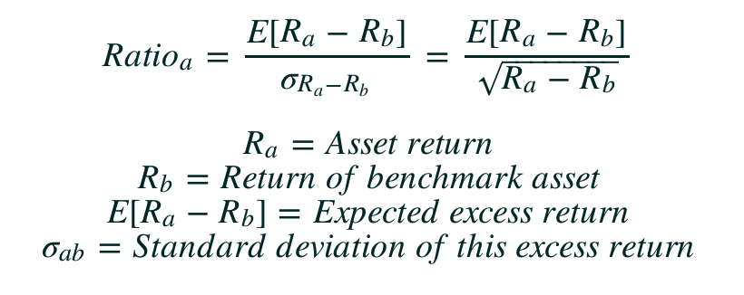
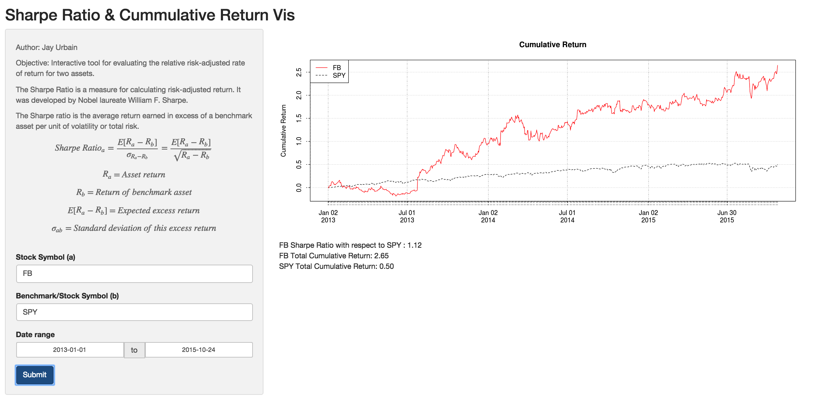

Sharpe Ratio & Cummulative Return Vis
========================================================
css: jaystyle.css
author: Jay Urbain

October 24, 2015

- Sharpe, W. F. (1966). "Mutual Fund Performance". Journal of Business 39 (S1): 119–138. [doi:10.1086/294846](http://www.iijournals.com/doi/abs/10.3905/jpm.1994.409501).
- Sharpe, William F. (1994). "[The Sharpe Ratio](http://www.stanford.edu/~wfsharpe/art/sr/sr.htm)". The Journal of Portfolio Management 21 (1): 49–58.
- Jobson JD; Korkie B (September 1981). "Performance hypothesis testing with the Sharpe and Treynor measures". The Journal of Finance 36 (4): 888–908. [JSTOR 2327554](http://www.jstor.org/stable/2327554?&seq=1#page_scan_tab_contents).
- Sharpe ratio. (2015, August 28). In Wikipedia, The Free Encyclopedia. Retrieved 22:03, October 24, 2015, from [https://en.wikipedia.org/w/index.php?title=Sharpe_ratio&oldid=678344815](https://en.wikipedia.org/w/index.php?title=Sharpe_ratio&oldid=678344815)

Objective
========================================================
Develop an interactive tool for evaluating the relative risk-adjusted rate of return for one investment relative to another investment.

- A fundmental issue when investing in stocks or other assets is the performance of an investment relative to its risk.
- The Sharpe ratio is a way to examine the performance of an investment by adjusting for its risk.

- The Sharpe ratio measures the excess return (or risk premium) per unit of deviation in an investment asset or a trading strategy.

- Encapsulating the Sharpe ratio within an interactive tool allows for easy comparisons of risk adjusted performance of different investments with respect to the same benchmark asset.

- Plots of cumulative returns help investors better comprehend the magnitude and variance of those returns with respect to a benchmark asset.

Sharpe Ratio
========================================================
The Sharpe Ratio is a measure for calculating risk-adjusted return. It was developed by Nobel laureate William F. Sharpe.

The ratio measures the excess return (or risk premium) per unit of deviation in an investment asset or a trading strategy, typically referred to as risk.

Sharpe Vis: AAPL relative to SPY benchmark
========================================================

The Sharpe ratio for Apple Computer (AAPL) relative to the S&P Index (SPY) from 2013-01-01 to 2015-10-24 is **-0.39**.

Since the ratio is negative, AAPL underperformed the SPY benchmark asset with respect to risk adjusted return.

Sharpe Vis: FB relative to SPY benchmark
========================================================

The Sharpe ratio for Facebook (FB) relative to the S&P Index (SPY) from 2013-01-01 to 2015-10-24 is **1.12**.

Since the ratio is strongly postive, FB outperformed the SPY benchmark asset with respect to risk adjusted return, and clearly outperformed AAPL when comparing Sharpe ratios to the SPY.

